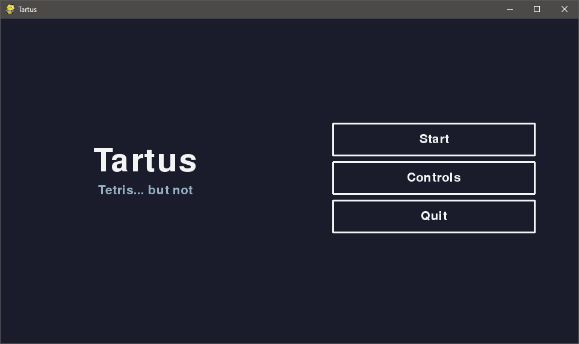
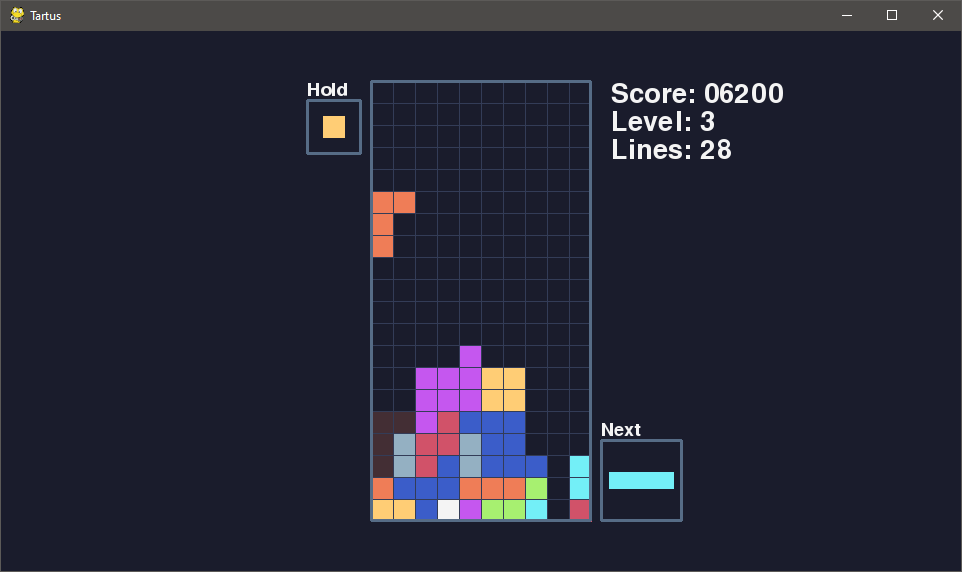
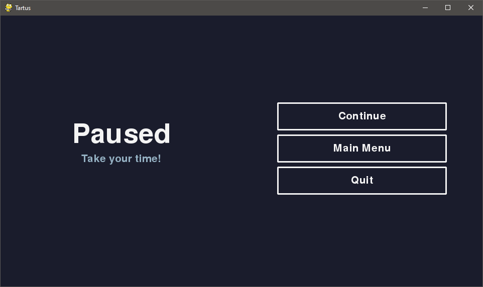

# Tartus Game

A recreation of tetris in python

## Screen Shots

## Extra Features

- holding peices
- quick dropping
- bag based piece randomization
- extra 1 by 1 piece
- extra 2 by 1 piece

## How to play

1. download and install the latest version of python3 and pip
2. `pip3 install -r requirements.txt`
3. `python main.py`
